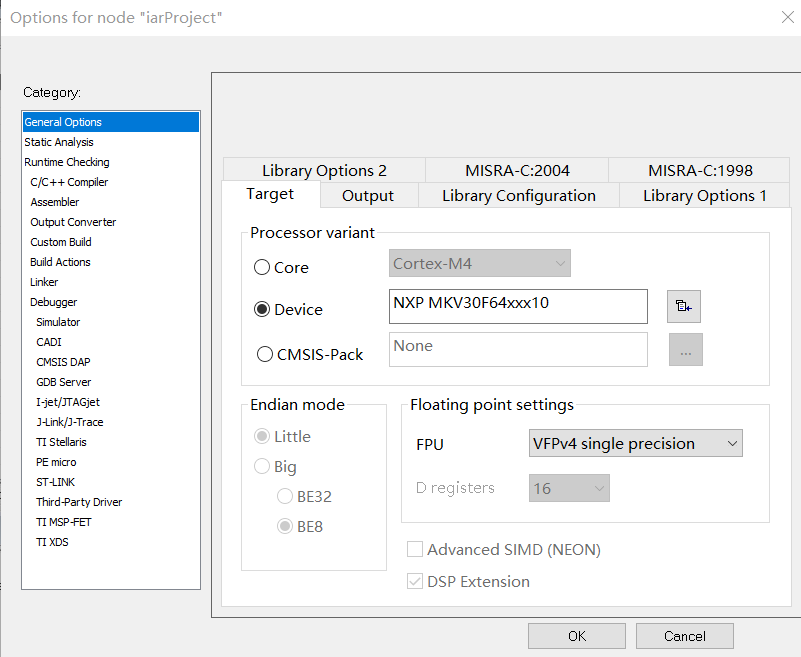
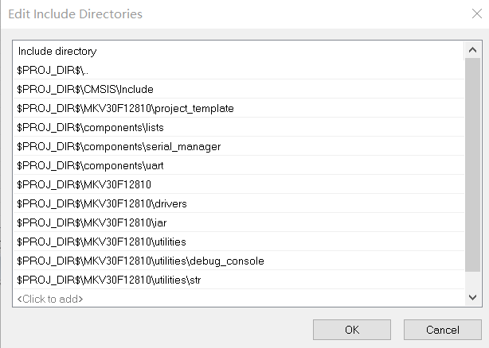
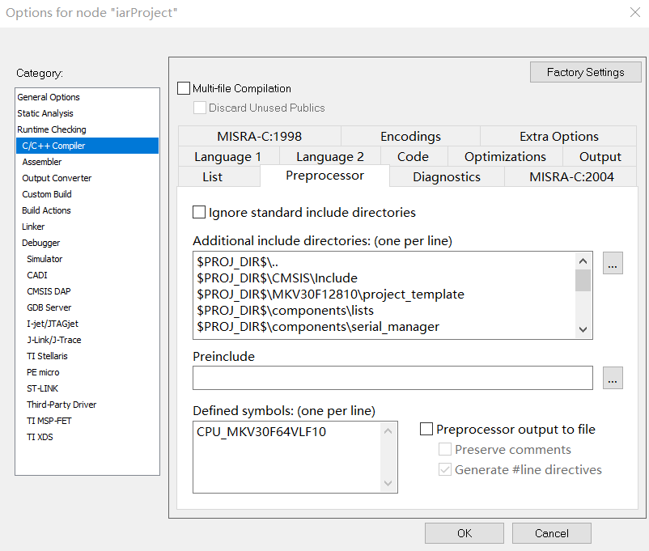
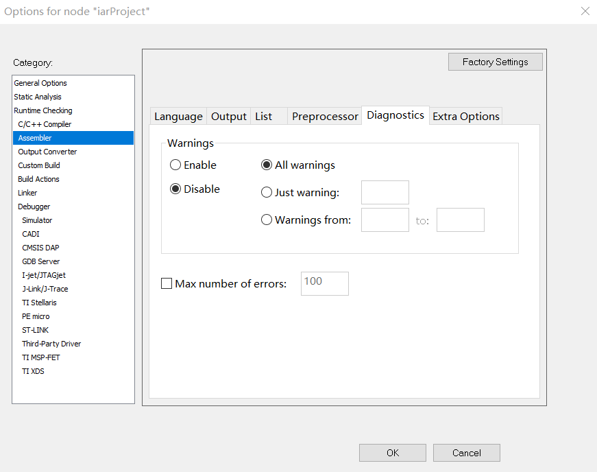
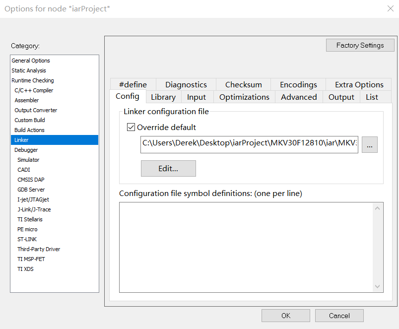
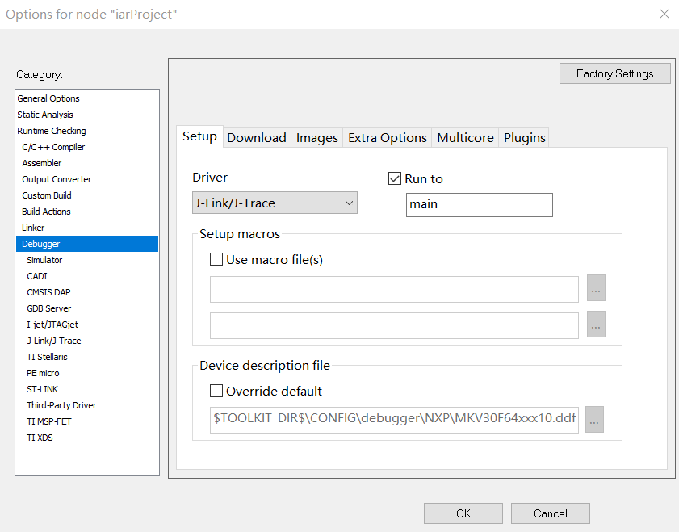
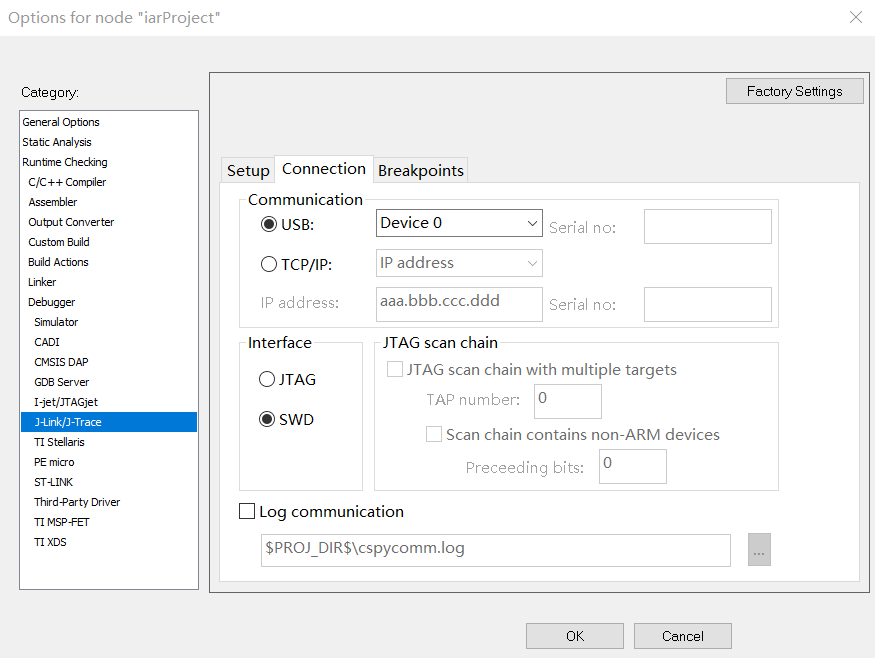

# 3.3.2.修改 Options

---

###Step 1.右键工程结构树最上层目录(iarProject)，点击 Options

###Step 2.General Options->Target,Processor variant 选择 Device,NXP MKV30F64xxx10

###Step 3.C/C++ Complier->Preprocessor,添加文件路径

###Step 4.C/C++ Complier->Preprocessor,添加芯片定义

###Step 5.Assembler->Diagnostics，Warnings Disable

###Step 6.Linker->Config，勾选 Override default，选择 MKV30F64xxx10_flash.icf 文件，文件位于 ./MKV30F12810/iar

###Step 7.Debugger->Setup，Driver 选择 J-Link/J-Trace

###Step 8.Debugger.J-Link/J-Trace->Connection，Driver Interface 选择 SWD

