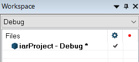
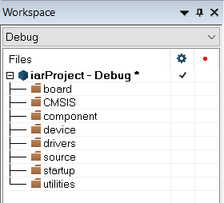
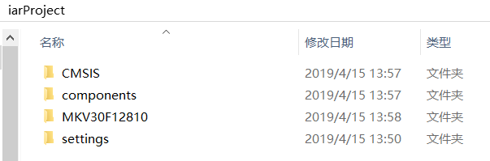
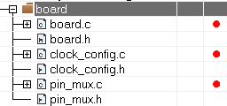
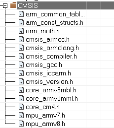
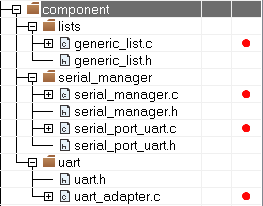
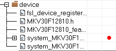
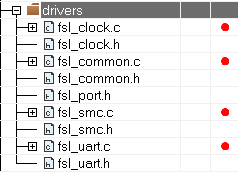
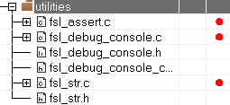

# 3.3.1.添加目录结构树

---

###Step 1.左边的工程结构树如下，修改结构树，在结构树文件夹右键 Add Group 则可以添加文件夹

###Step 2.工程结构树修改完成，如图

###Step 3.将下载的 SDK 解压，并将 SDK 根目录下的 components、CMSIS、devices/MKV30F12810 复制到新建的工程文件夹下，如图

###Step 4.右键工程结构树的 Board，添加以下文件，文件位于 ./MKV30F12810/project_template

###Step 5.右键工程结构树的 CMSIS，添加以下文件，文件位于 ./CMSIS/Include

###Step 6.右键工程结构树的 component，添加以下文件，文件位于 ./component/lists、./component/serial_manager、./component/uart

###Step 7.右键工程结构树的 device，添加以下文件，文件位于 ./MKV30F12810/

###Step 8.右键工程结构树的 drivers，添加以下文件，文件位于 ./MKV30F12810/drivers

###Step 9.右键工程结构树的 startup，添加以下文件，文件位于 ./MKV30F12810/iar

###Step 10.右键工程结构树的 utilities，添加以下文件，文件位于 ./MKV30F12810/utilities、./MKV30F12810/utilities/debug_console、./MKV30F12810/utilities/str

