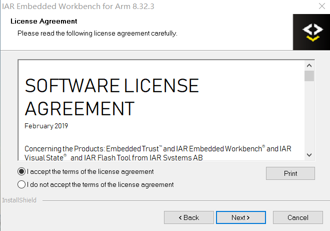
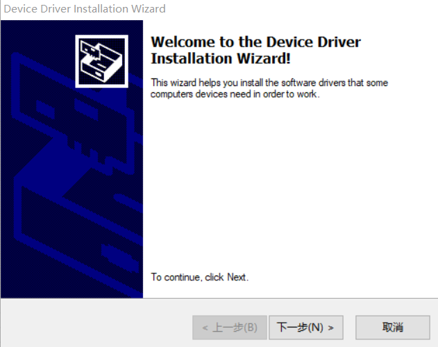
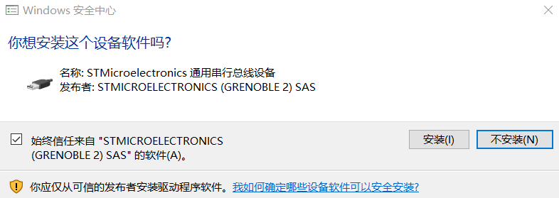

# 3.1.下载并安装 IAR

[IAR 下载地址](https://www.iar.com/iar-embedded-workbench/#!?architecture=Arm)

---

###Step 1.进入下载页面，下载 IAR 安装包

###Step 2.点击安装包，选择 Install IAR Embedded Workbench for Arm

###Step 3.点击 Next

###Step 4.选择 I accept，点击 Next

###Step 5.选择安装路径，点击 Next

###Step 6.选择调试工具，点击 Next

###Step 7.快捷方式文件夹命名，点击 Next

###Step 8.移除所有的 USB Dongle，点击确定

###Step 9.点击 Install

###Step 10.点击 I Agree

###Step 11.安装设备驱动，点击下一步

###Step 12.点击安装

###Step 13.安装设备驱动，点击下一步

###Step 14.点击安装

###Step 15.选择 I accept，点击 Next

###Step 16.选择安装路径，点击 Next

###Step 17.点击 Next

###Step 18.点击安装

