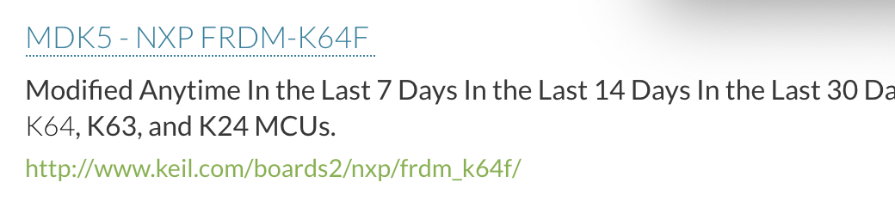
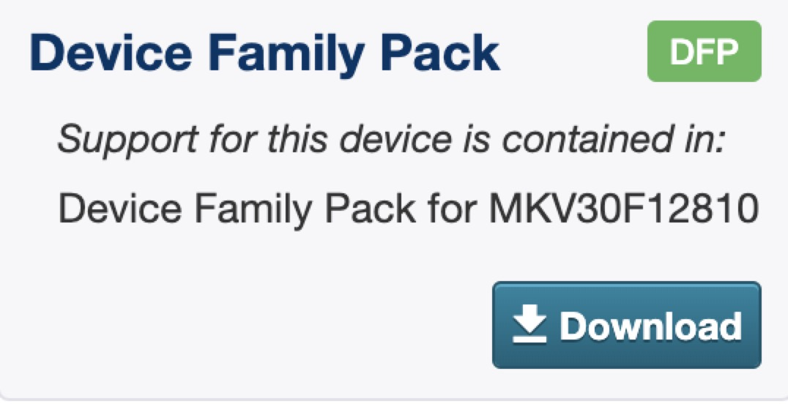
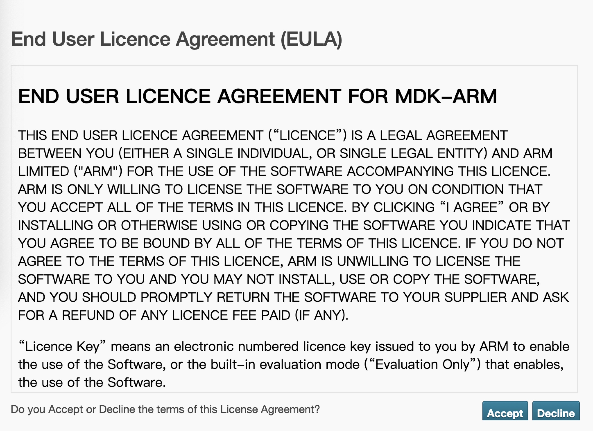
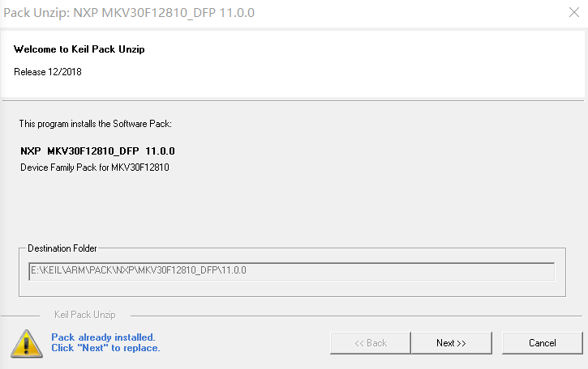
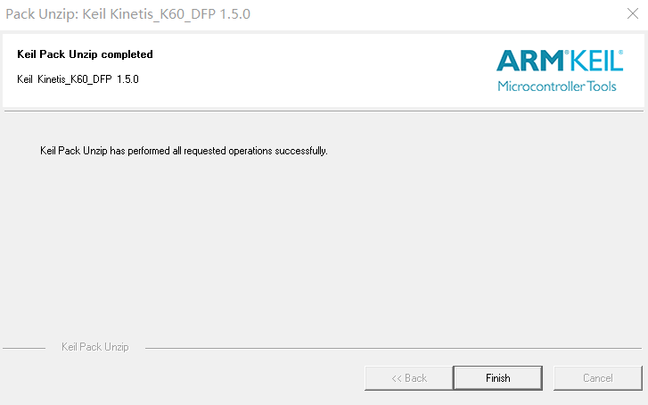

# 2.3.下载 Package

[Package 下载地址](http://www.keil.com/product/)

---

###Step 1.搜索你要下载的 arm 芯片，在这里以 M64 为例

###Step 2.选择 MD5-NXP FRDM-K64F

###Step 3.页面右下角下载 Pack，点击 Download

###Step 4.点击 Accept

###Step 5.打开下载好的 Pack，它会自动搜寻你的 Keil 路径，点击 Next

###Step 6.点击 Finish

