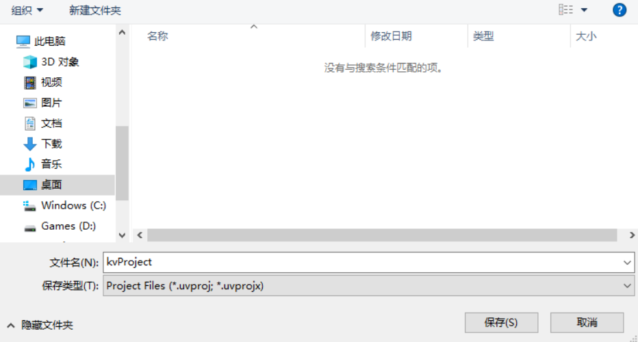
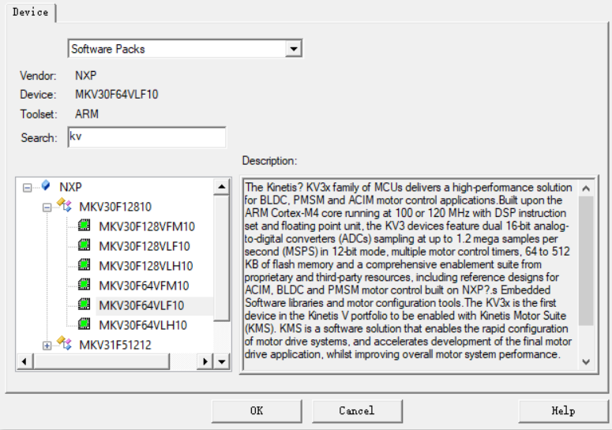
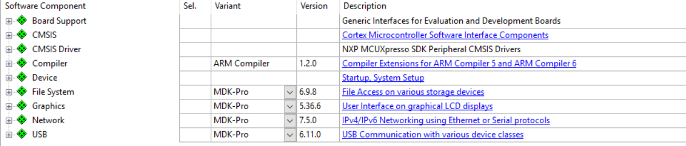

# 2.4.Keil 工程搭建

---

###Step 1.在指定位置新建工程文件夹，指定名字为 kv30Project

###Step 2.双击下载好的 Keil，点击工具栏 Project -> New uVision Project...，保存你的工程文件到上一步新建的工程文件夹中，取名为 kv30Project

###Step 3.在这里使用的是 MKV30F64VLF10

###Step 4.点击 OK

