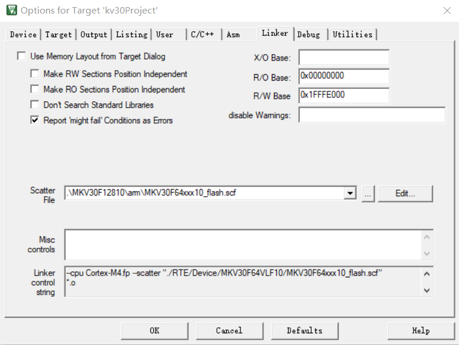

# 2.4.2.修改 Options

---

###Step 1.点击上方工具栏的 Option 按钮

###Step 2.选择 Target 子窗口，勾选上 Use MicroLIB

###Step 3.选择 C/C++ 子窗口，Misc Controls 添加以下参数

###Step 4.选择 C/C++ 子窗口，Include Paths 添加以下路径

###Step 5.选择 Linker 子窗口，取消勾选 Use Memory Layout from Target Dialog，修改 Scatter File，添加 .scf 文件，文件路径位于 ./MKV30F12810/arm/MKV30F64xxx10_flash.scf

