# 2.4.1.添加目录结构树

---

**Step1.左边的工程结构树如下，修改结构树，鼠标点击结构树文件夹名称，再单击一次文件夹名称则可以重命名，在结构树文件夹右键 Add Group 则可以添加文件夹**

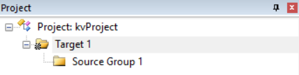

**Step2.工程结构树修改完成，如图**

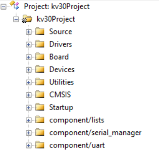

**Step3.将下载的 SDK 解压，并将 SDK 根目录下的 components、CMSIS、devices/MKV30F12810 复制到新建的工程文件夹下，如图**

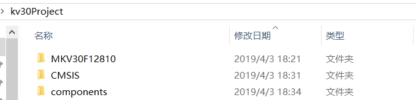

**Step4.双击工程结构树的 Drivers 文件夹，添加以下文件，文件位于 ./MKV30F12810/drivers**

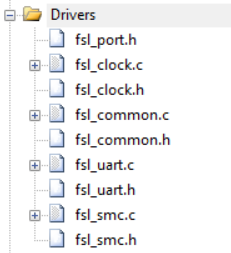

**Step5.双击工程结构树的 Board 文件夹，添加以下文件，文件位于 ./MKV30F12810/project_template**

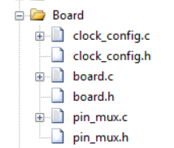

**Step6.双击工程结构树的 Devices 文件夹，添加以下文件，文件位于 ./MKV30F12810**

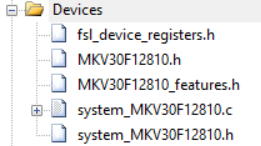

**Step7.双击工程结构树的 Utilities 文件夹，添加以下文件，文件位于 ./MKV30F12810/utilities、./MKV30F12810/utilities/debug_console、./MKV30F12810/utilities/str**

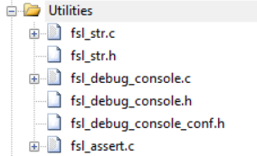

**Step8.双击工程结构树的 CMSIS 文件夹，添加以下文件，文件位于 ./CMSIS/Include**

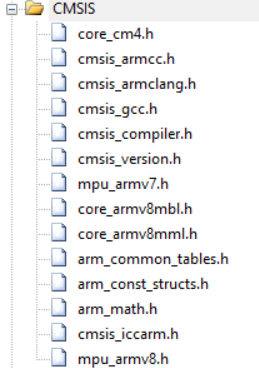

**Step9.双击工程结构树的 Startup 文件夹，添加以下文件，文件位于 ./MKV30F12810/arm**

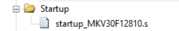

**Step10.双击工程结构树的 component/lists 文件夹，添加以下文件，文件位于 ./components/lists**

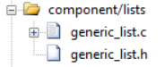

**Step11.双击工程结构树的 component/serial_manager 文件夹，添加以下文件，文件位于 ./components/serial_manager**

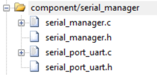

**Step12.双击工程结构树的 component/uart 文件夹，添加以下文件，文件位于 ./components/uart**

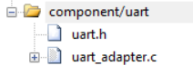
