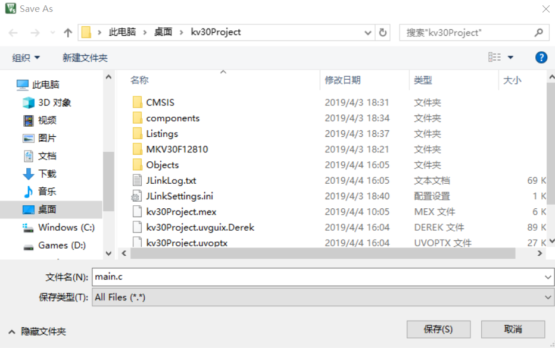

# 2.4.4.HelloWord 示例

---

###Step 1.将工程结构树 Board 中的 pin_mux.c、pin_mux.h、clock_config.c、clock_config.h 文件替换成 MCUXpresso Config Tools 生成的对应文件

###Step 2.修改 board.c 文件，文件代码如下

```
#include <stdint.h>
#include "board.h"
#include "fsl_common.h"
#include "fsl_debug_console.h"

#define BOARD_DEBUG_UART_CLK_FREQ CLOCK_GetCoreSysClkFreq()
#define BOARD_DEBUG_UART_INSTANCE 0U
#ifndef BOARD_DEBUG_UART_BAUDRATE
#define BOARD_DEBUG_UART_BAUDRATE 115200
#endif
#define BOARD_DEBUG_UART_TYPE kSerialPort_Uart

void BOARD_InitDebugConsole(void) {
    uint32_t uartClkSrcFreq = BOARD_DEBUG_UART_CLK_FREQ;
    DbgConsole_Init(BOARD_DEBUG_UART_INSTANCE, BOARD_DEBUG_UART_BAUDRATE, BOARD_DEBUG_UART_TYPE, uartClkSrcFreq);
}

```

###Step 3.点击工具栏的新建文件，生成一个空白 Text 文件，然后点击保存，文件名字修改成 main.c，保存到工程的根目录\*\*



###Step 4.双击工程结构树的 Souce 文件夹，将 main.c 文件引入


###Step 5.修改 main.c 文件如下

```
#include "board.h"
#include "fsl_debug_console.h"
#include "clock_config.h"
#include "pin_mux.h"

int main(void)
{
  BOARD_InitPins();
  BOARD_BootClockRUN();
  BOARD_InitDebugConsole();
  PRINTF("hello world!\r\n");
  while(1)
  {

  }
}
```

###Step 6.编译，烧录代码进板子，串口助手打印以下信息，完成工程文件的搭建


