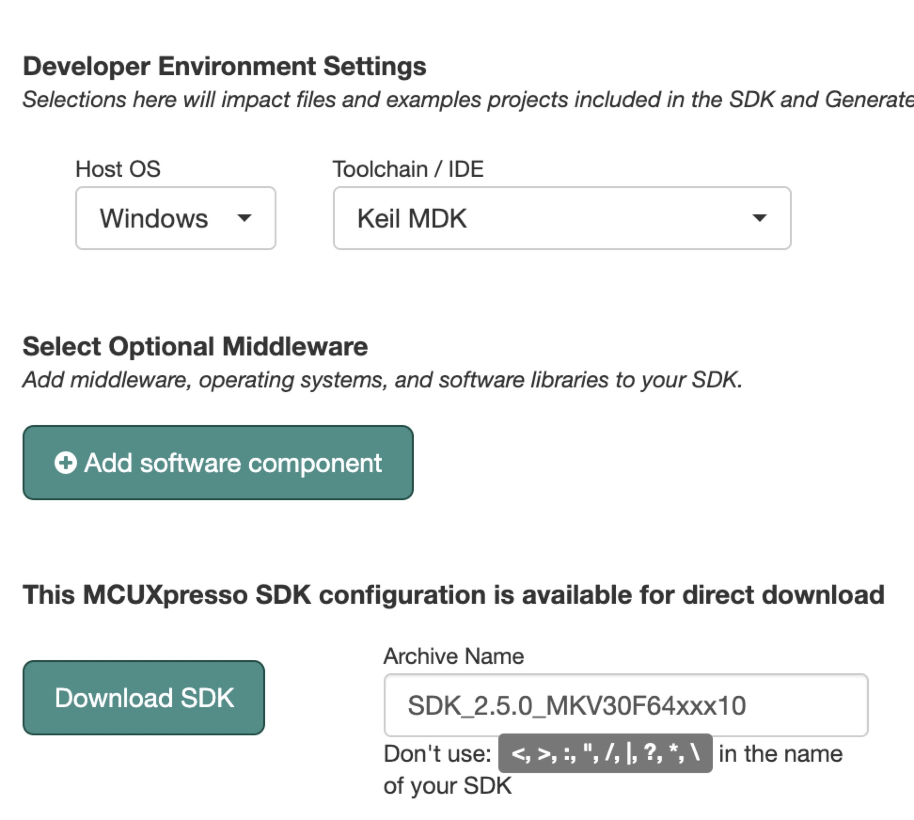

# 2.2.下载 SDK

[SDK 下载地址](https://mcuxpresso.nxp.com/en/select)

---

###Step1.进入下载地址,搜索你要下载芯片的 SDK，这里以 LPC55S69 为例，选择 LPC55S69，右方会显示该芯片的信息，然后点击 Build MCUXpresso SDK

###Step2.选择 Windows 主机系统，下载的工具链为 Keil MDK，组件默认即可，若有特别的组件需求可自己添加进去，点击 Download SDK

