# 4.5.使用 MCUXpresso IDE 调试代码

---

###4.5.1.打开必要的视图窗口，选择窗口->显示视图->其它
**选择常规 -> 项目资源管理器**

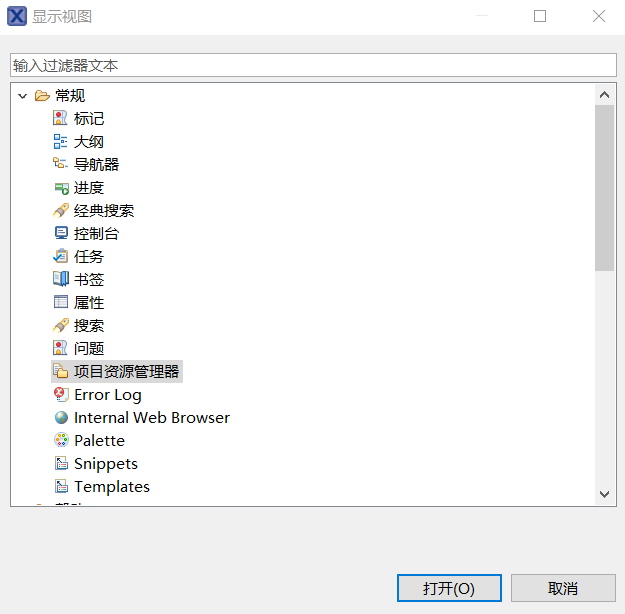

**选择 MCUXpresso IDE -> Installed SDKs**

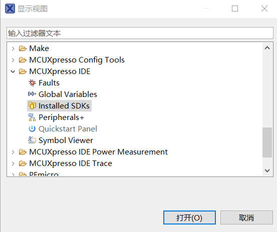

**选择 MCUXpresso IDE -> Quickstart Panel**

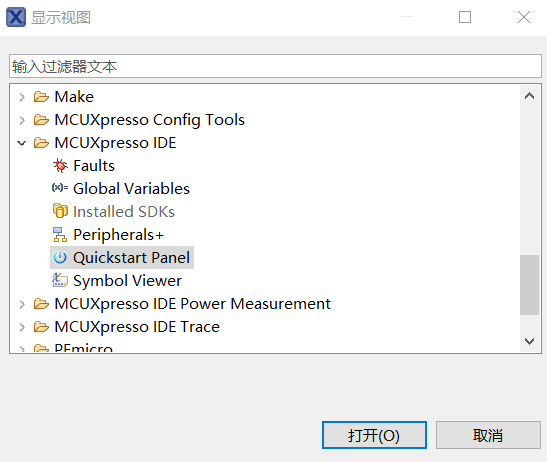

###4.5.2.将下载好的 SDK 压缩包拖动到视图的 Installed SDKs 中

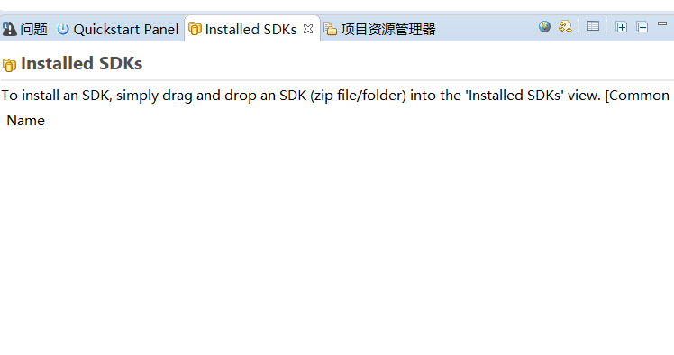

**是否将 SDK 压缩包解压放到 SDK 仓库中，在外部的文件夹路径你可以看到你的 SDK 压缩包已经被解压出来了**

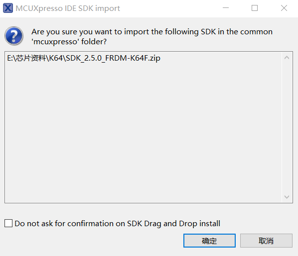

**当视图的 InstalledSDKs 出现你放进来的 SDK 包则证明你已经完成了 SDK 的载入**

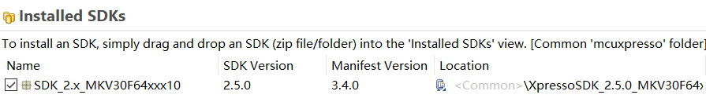

###4.5.3.导入 SDK 工程到 IDE 调试

**点击视图中的 Quickstart Panel->Import SDK example(s)**

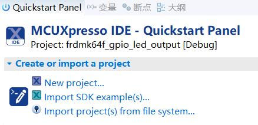

**选择左上角已被你载入的 SDK 包，再选择对应的开发版 GUI，点击下一步**

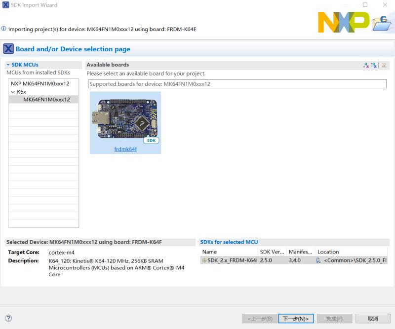

**Project name prefix:生成的文件夹名的前缀** 
**Project name suffix:生成的文件夹名的后缀** 
**SDK Debug Console:Semihost(允许代码在 Debug Viewer 中查看** 
**选择你要调试的 SDK,在这里以 gpio_led_output 举例，点击下一步，若采取默认配置也可直接完成** 

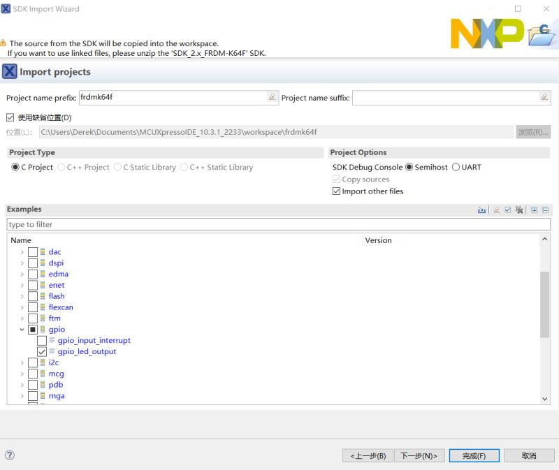

**Relib 是 IDE 针对嵌入式优化的库，在这个界面具体有以下功能,采取默认配置点击完成：** 
**I.重定向配置** 
**II.硬件配置** 
**III.MCU C 编译器** 
**IV.MCU 链接** 
**V.Memory 相关配置** 

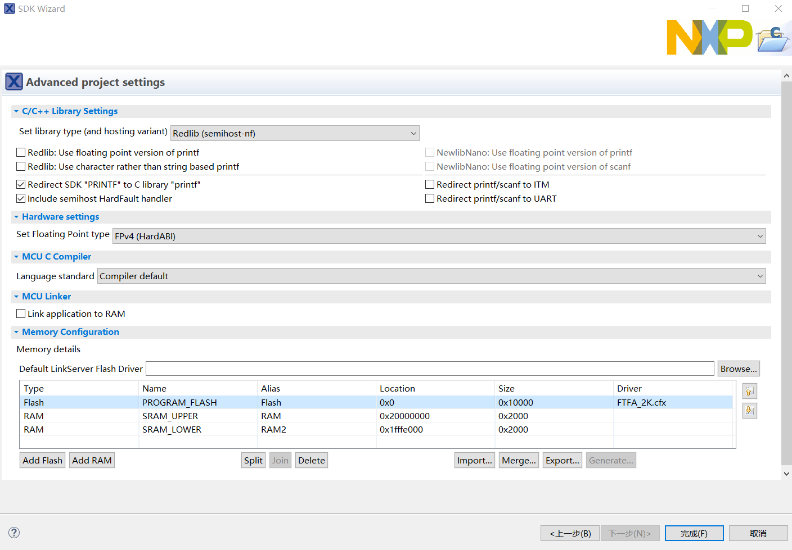

**查看视图的项目资源管理器，出现 SDK 项目，则导入工程完成**

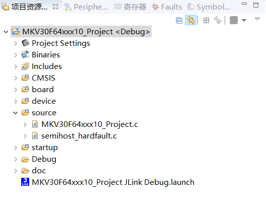

**把开发版接入电脑，点击视图的 Quickstart Panel，选择 Debug，右上的小图标也有对应的调试器，在这里采用默认 Debug**

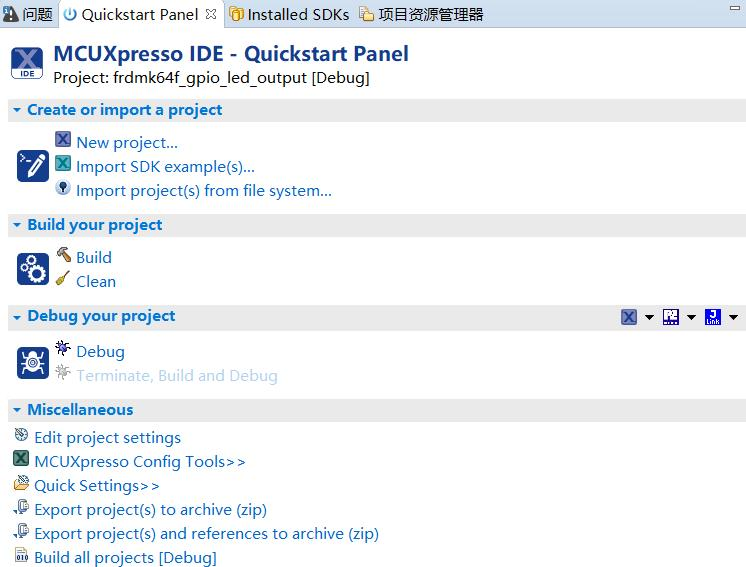

**选择默认配置，确定**

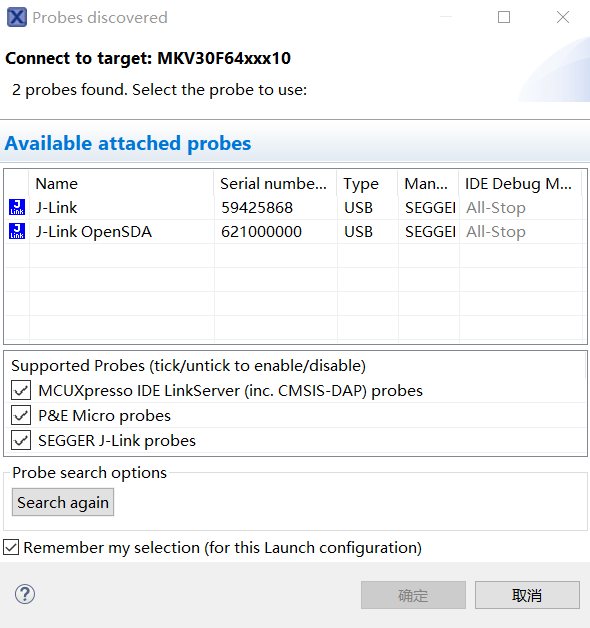

**由于开发版固件是 Jlink，所以会弹出以下窗口，点击 accept**

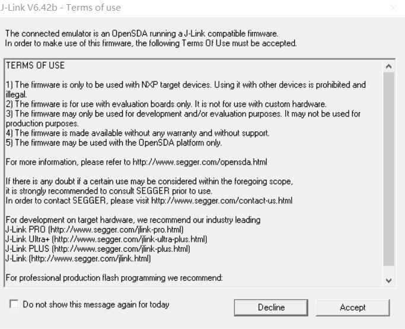

**打开调试必要视图，点击是**

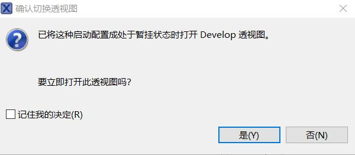

**你会发现界面已经切换成 Debug 模式，上方工具栏，有以下调试图标，点击 Start，板子的 led 灯开始闪烁**

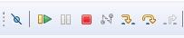

**在下方视图的控制台中看到打印出来的信息**

