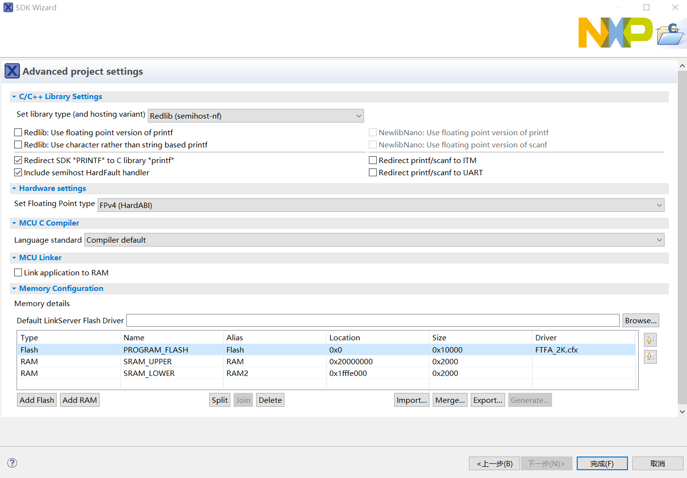
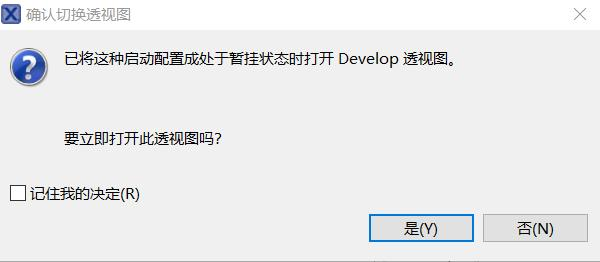

# 4.5.3.HelloWorld 示例

---

###Step 1.点击视图中的 Quickstart Panel->New project...

###Step 2.选择已被你载入的 SDK 包 KV3x，然后选择对应的芯片，在这里为 MKV30F64xxx10，点击下一步

###Step 3.SDK 包引入文件选择，在这里不引入任何 Driver，选择 ，默认配置，点击完成 
**Project name prefix:生成的文件夹名的前缀** 
**Project name suffix:生成的文件夹名的后缀** 
**Device Packages:MKV30F64VLF10** 
**SDK Debug Console:Semihost(允许代码在 Debug Viewer 中查看）** 

<!-- **Relib 是 IDE 针对嵌入式优化的库，在这个界面具体有以下功能,采取默认配置点击完成：** 
**I.重定向配置** 
**II.硬件配置** 
**III.MCU C 编译器** 
**IV.MCU 链接** 
**V.Memory 相关配置** 

 -->

###Step 4.查看视图的项目资源管理器，出现 SDK 项目，则新建工程完成

###Step 5.把开发版接入电脑，点击视图的 Quickstart Panel，选择 Debug，右上的小图标也有对应的调试器，在这里采用 JLink Debug

###Step 6.选择 J-Link 配置，点击确定

###Step 7.由于开发版固件是 Jlink，所以会弹出以下窗口，点击 accept

###Step 8.打开调试必要视图，点击是

###Step 9.你会发现界面已经切换成 Debug 模式，上方工具栏，有以下调试图标，点击 Start

###Step 10.在下方视图的控制台中看到打印出来的信息

