# 4.4.使用 MCUXpresso Config Tools 生成代码

---

## 生成配置外部晶振的时钟文件

###Step 1.打开 MCUXpresso Config Tools，选择为处理器，电路板，和套件创建新配置，点击下一步

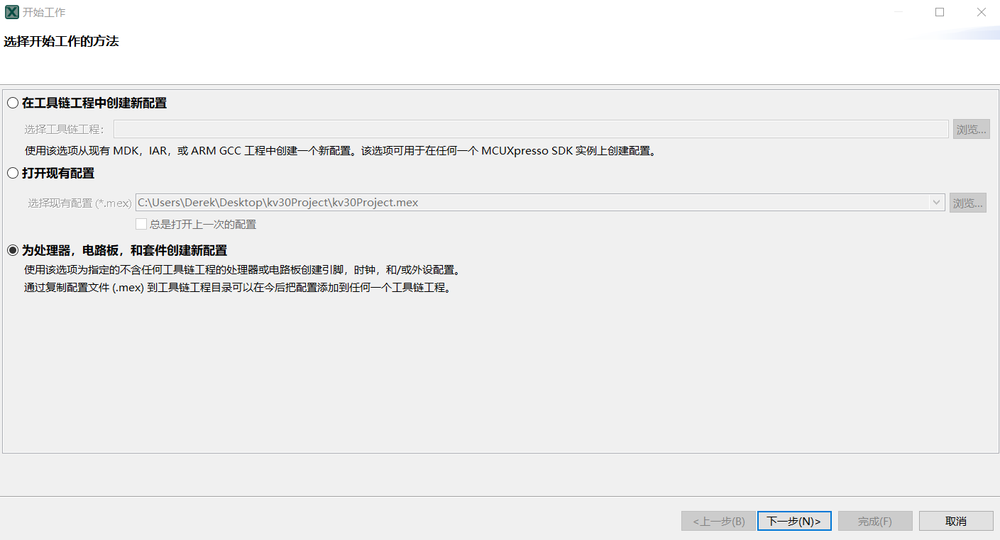

###Step 2.查询你配置的芯片，在这里为 MKV30F64xxx，封装为 MKV30F64VLF10 - LQFP 48 封装

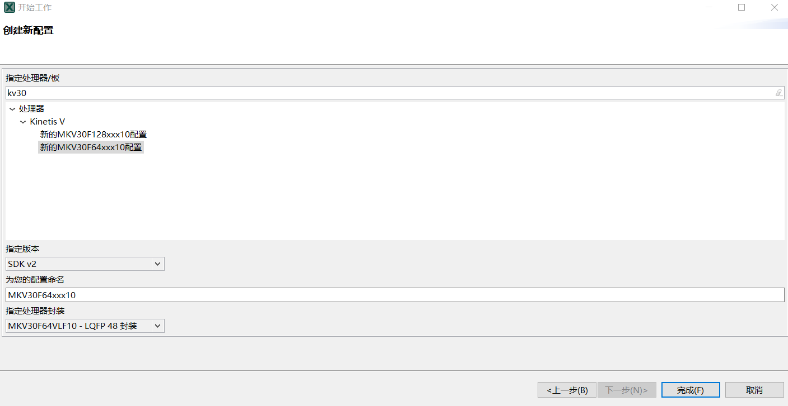

###Step 3.点击否

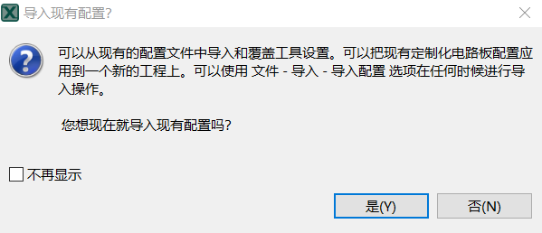

###Step 4.点击工具栏：工具-> 时钟，该芯片默认配置为内部时钟，点击外部 OSC 的 Inactive 框

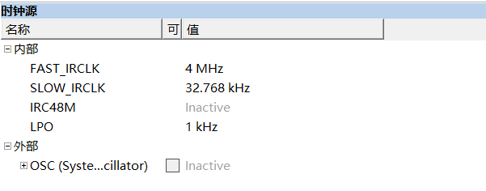

###Step 5.输入芯片的外部晶振参数，在这里使用的是无源的 8MHz 晶振，点击 OK

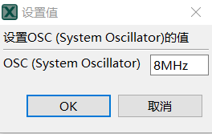

###Step 6.将外部 OSC 下拉框展开，OSC mode 选择 Using oscillator with external crystal(low power)，Frequency Range 选择 High frequency range 3-8 MHz, System Osc.Capacity Load 选择 0pF (芯片内部晶振的负载电容)

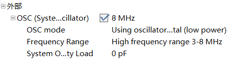

###Step 7.工具栏的 MCG Mode 从 FEI 模式切换成 FEE 模式

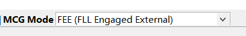

###Step 8.观察时钟显示图，时钟已配置成外部晶振输入

###Step 9.右方工具栏点击源代码，可查看自动生成的时钟代码文件，右方有个导出按钮，将时钟的 .c 和 .h 文件导出到指定目录

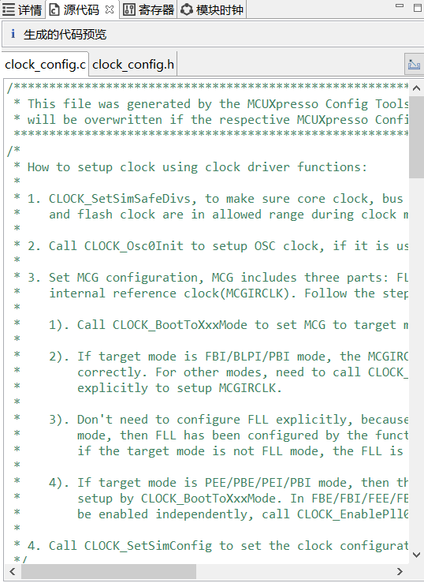

## 生成串口输出引脚文件

###Step 1.点击工具栏：工具-> 引脚，默认所有引脚都不配置

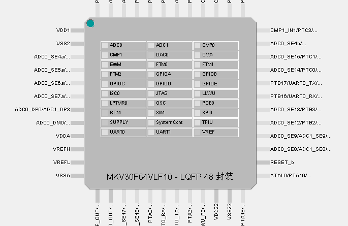

###Step 2.这里要配置 TX 串口引脚，该芯片的扩展串口 TX 为 PTB1，点击该引脚然后勾选 UART0_TX，点击已完成

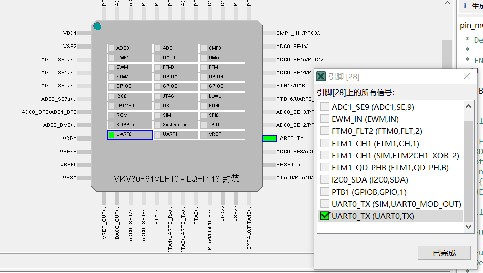

###Step 3.这里要配置 RX 串口引脚，该芯片的扩展串口 RX 为 PTB0，点击该引脚然后勾选 UART0_RX，点击已完成

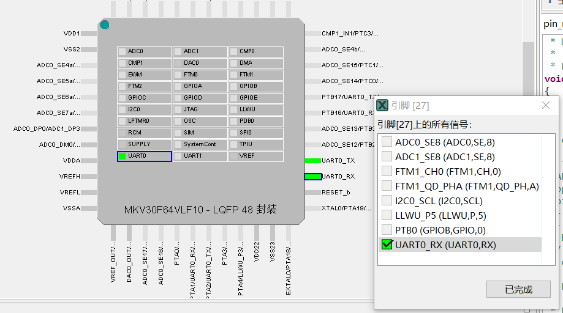

### Step 4.点击左方工具栏的源代码，可查看生成的引脚配置文件，点击右方的导出按钮，导出到指定文件夹

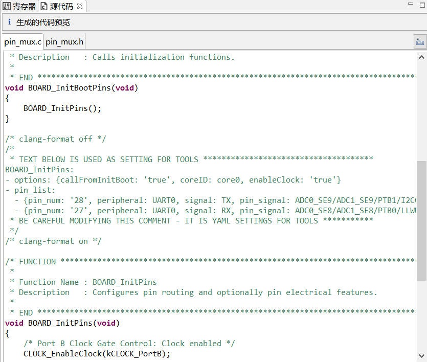
