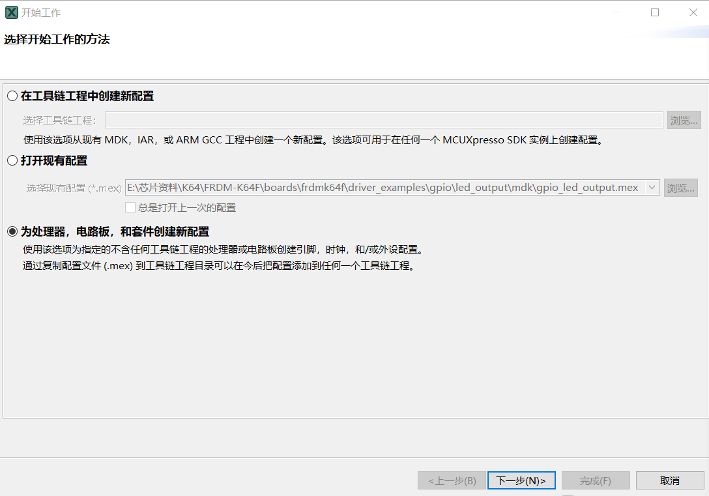
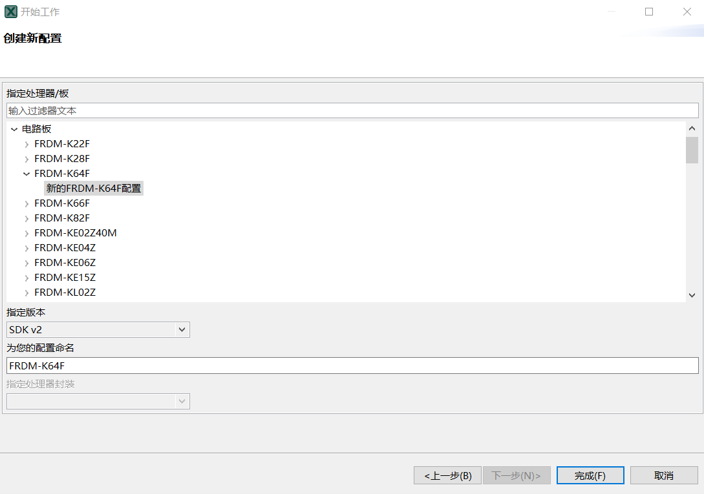
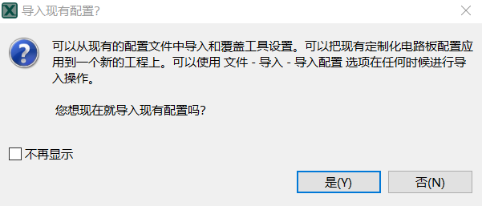
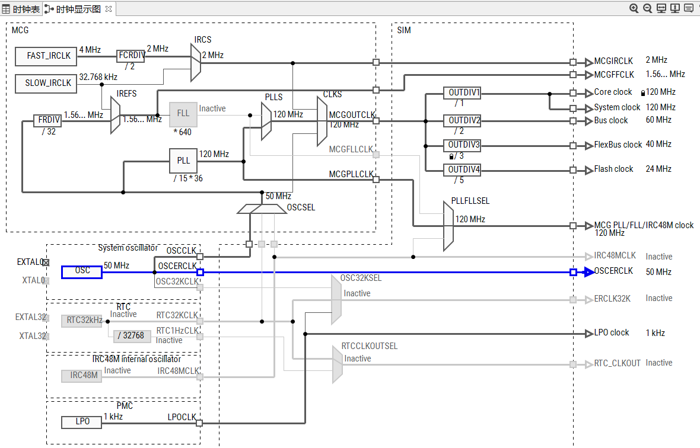
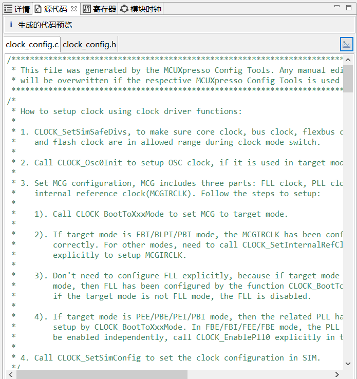
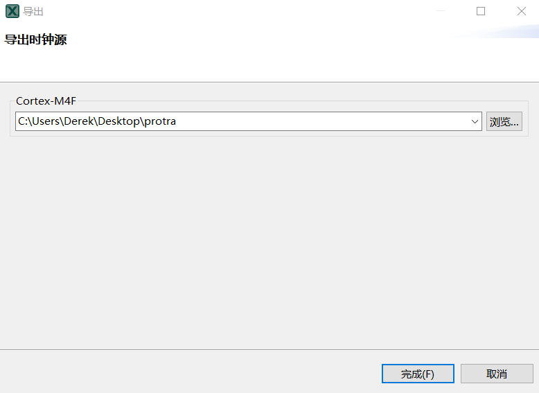

# 4.4.使用 MCUXpresso Config Tools 生成时钟源代码

---

**打开 MCUXpresso Config Tools,该工具可以在现有的示例上进行配置，但在这里选择为处理器，电路板，和套件创建新配置，点击下一步**

**是否导入配置，选择否**

**是否导入配置，选择否**

**从时钟表中可看到默认的时钟配置，可在这里修改时钟配置**

**从时钟表显示图可看到默认的时钟配置，可在这里修改时钟配置**

**修改后的时钟配置，从右边的工具栏中点击源代码，可查看生成的源代码，点击右方的导出小按钮可将源代码导出加载到任意的工程中**

**选择导出时钟源的路径，点击完成，可在文件路径中查看被导出的文件**

