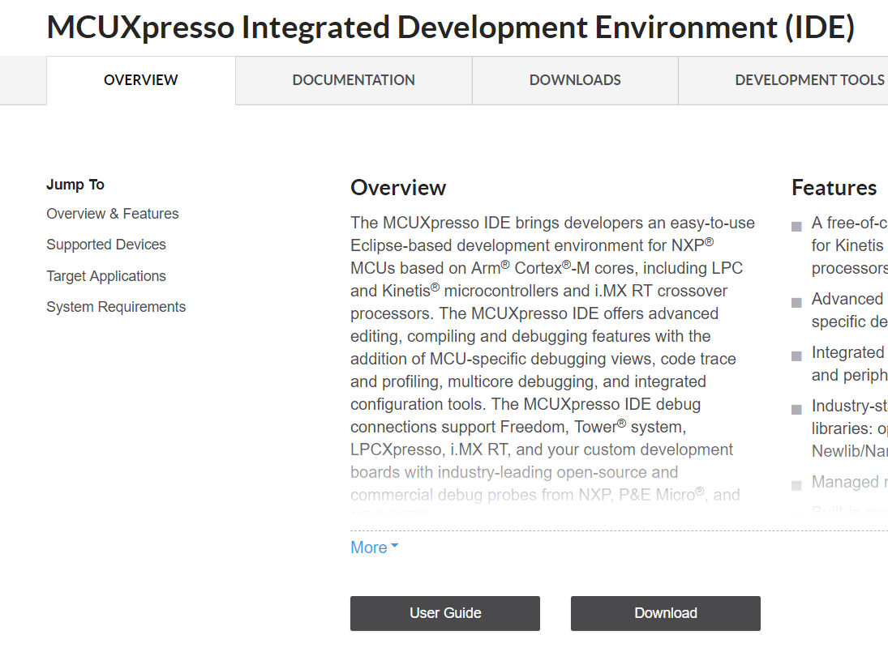
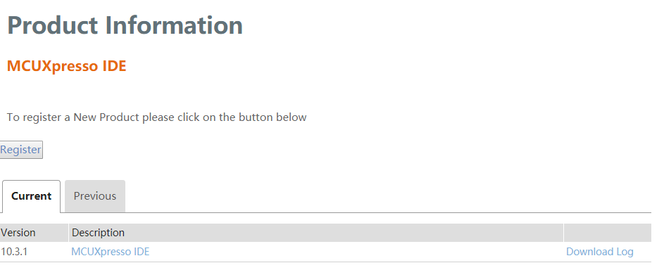
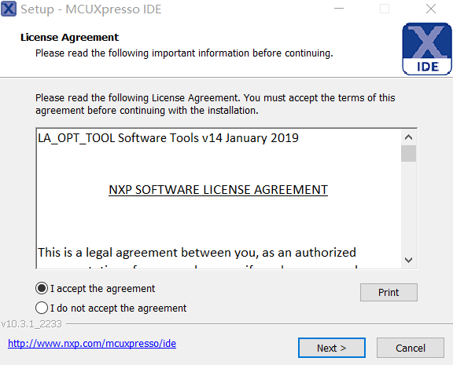
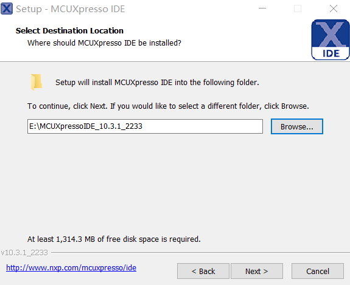
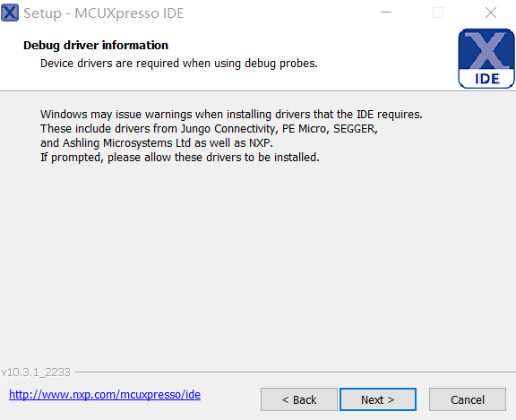
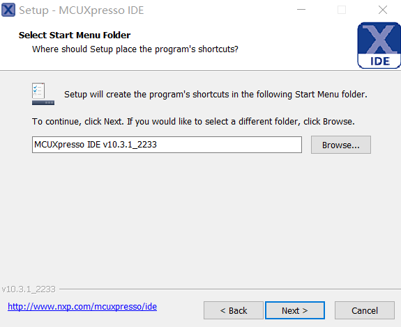
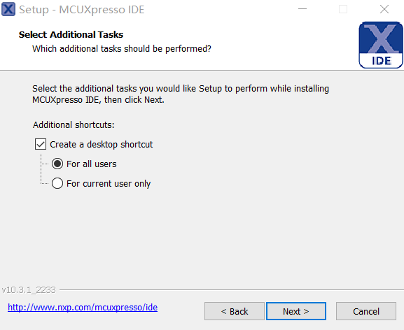
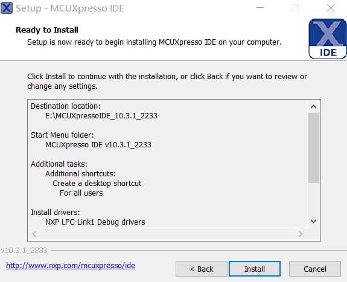
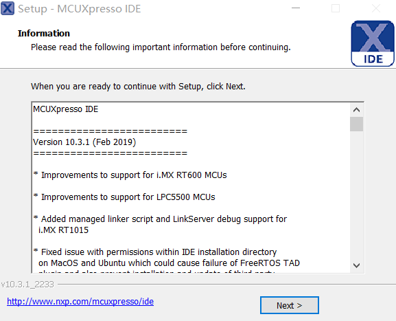
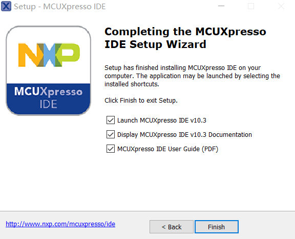

# 4.1.下载并安装 MCUXpresso IDE

[MCUXpressoIDE 下载页面](https://www.nxp.com/support/developer-resources/software-development-tools/mcuxpresso-software-and-tools/mcuxpresso-integrated-development-environment-ide:MCUXpresso-IDE)

---

###Step 1.进入下载页面，点击 Download

###Step 2.点击 MCUXpresso IDE

###Step 3.选择 MCUXpresso v10.3.1 - Windows，等待下载完成

###Step 4.双击安装包，选择 I accept the agreement，点击 Next

###Step 5.点击 Next

###Step 6.选择安装路径，点击 Next

###Step 7.点击 Next

###Step 8.选择创建快捷键名称，点击 Next

###Step 9.允许任何人打开，点击 Next

###Step 10.点击 Install

###Step 11.点击 Next

###Step 12.点击 Finish

