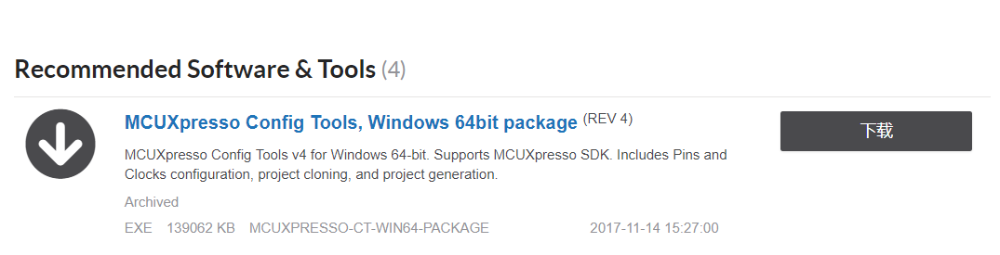
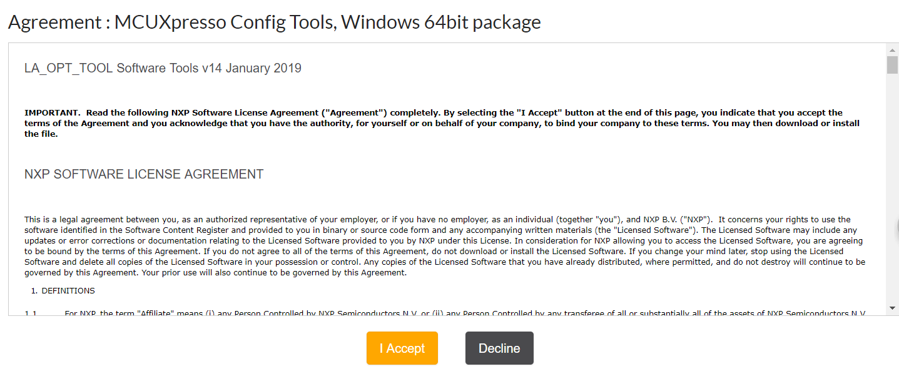
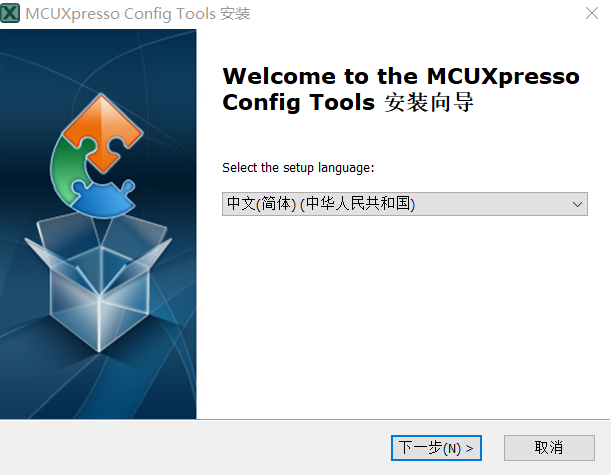
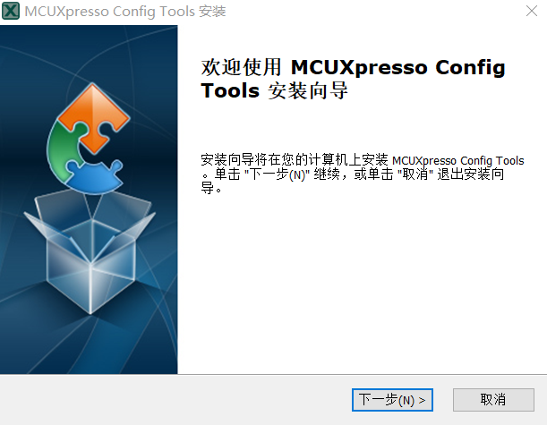
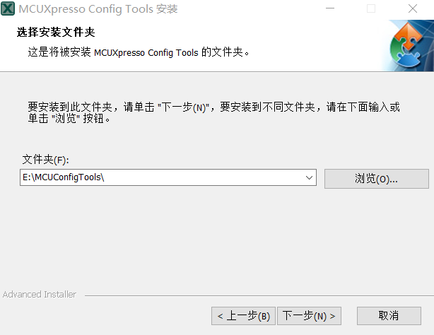
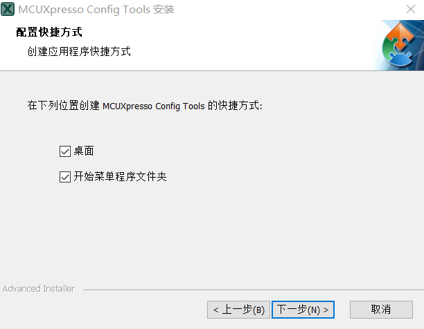
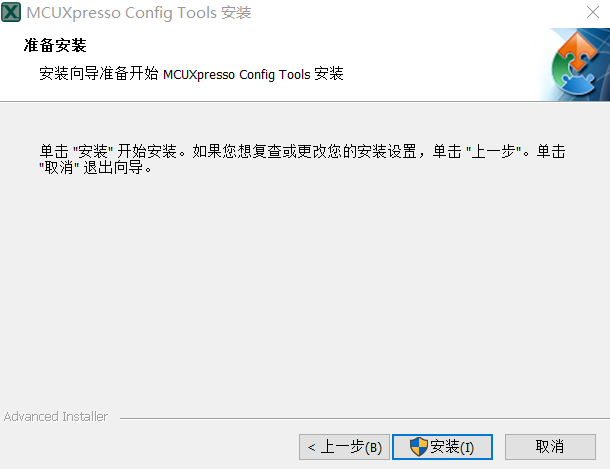
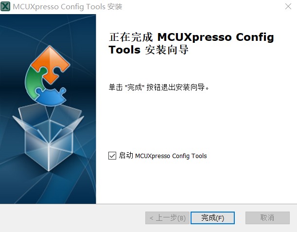

# 4.2.下载并安装 MCUXpresso Config Tools

[MCUXpressoConfigTools 下载页面](https://www.nxp.com/cn/support/developer-resources/software-development-tools/mcuxpresso-software-and-tools/mcuxpresso-config-tools-pins-clocks-peripherals:MCUXpresso-Config-Tools?tab=Design_Tools_Tab)

---

###Step 1.进入下载页面，点击下载

###Step 2.点击 I Accept

###Step 3.选择语言，点击下一步

###Step 4.点击下一步

###Step 5.选择安装路径，点击下一步

###Step 6.创建快捷方式，点击下一步

###Step 7.点击安装

###Step 8.点击完成

